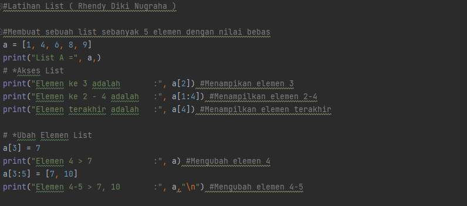

# PRAKTIKUM 4
Pada tugas praktikum ini, Saya akan membuat program python dengan fungsi list, lengkap beserta flowchartnya. 
## Latihan
Sebelum memulai pembuatan praktikum, Saya membuat sebuah program latihan terlebih dahulu, dan menjelaskan fungsi dari list. Berikut inilah program latihan list yang saya buat :  
• Membuat sebuah list dengan elemen sebanyak 5 buah dengan isi nilai bebas. 
• Disini saya akan mengakses list, mengubah, dan menambah elemen pada list. 
• Adapun program Pythonnya adalah sebagai berikut : 
 
 
• Dengan program seperti ini, maka akan menghasilkan output seperti ini : 
 
