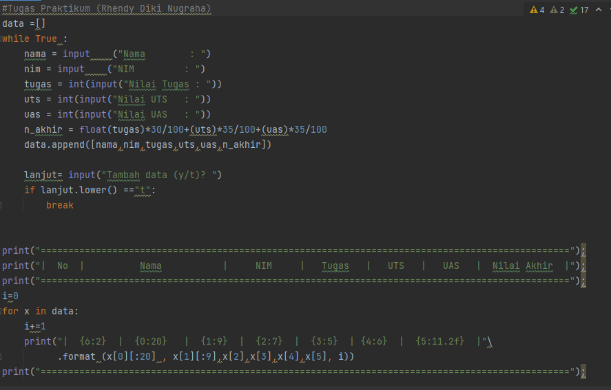
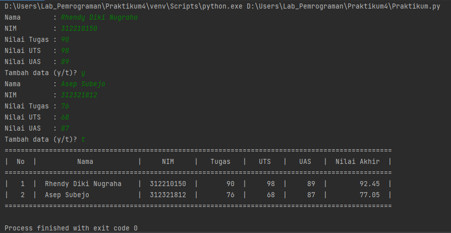
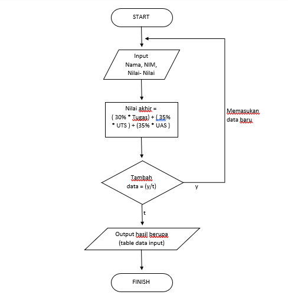

# PRAKTIKUM 4
| No | DAFTAR ISI | LINKS                                                                |
|-------------|------------|----------------------------------------------------------------------|
|  1 | Latihan    | [Menuju Kesini](https://github.com/RhendyDikiN/Praktikum4#latihan)   |
|  2 | Praktikum  | [Menuju Kesini](https://github.com/RhendyDikiN/Praktikum4#praktikum) |
|  3 | Flowchart  | [Menuju Kesini](https://github.com/RhendyDikiN/Praktikum4#flowchart) |
|  4 | Penutup    | [Menuju Kesini](https://github.com/RhendyDikiN/Praktikum4#penutup)   |

Pada tugas praktikum ini, Saya akan membuat program python dengan fungsi list, lengkap beserta flowchartnya. 
## Latihan
Sebelum memulai pembuatan praktikum, Saya membuat sebuah program latihan terlebih dahulu, dan menjelaskan fungsi dari list. Berikut inilah program latihan list yang saya buat :  
• Membuat sebuah list dengan elemen sebanyak 5 buah dengan isi nilai bebas. 
• Disini saya akan mengakses list, mengubah, dan menambah elemen pada list. 
• Adapun program Pythonnya adalah sebagai berikut : 
 
 
• Dengan program seperti ini, maka akan menghasilkan output seperti ini : 
  
Inilah beberapa fungsi dari list, setelah melakukan latihan ini. Selanjutnya kita akan memulai membuat praktikum. Tanpa banyak basa basi lagi, inilah programnya : 
## Praktikum
Program yang akan Saya buat pada praktikum ini adalah, menginput data nilai akhir dari Mahasiswa. Data yang di inputkan ini akan berubah otomatis menjadi tabel. Tentunya praktikum ini, Saya menggunakan fungsi list pada Python. Caranya adalah sebagai berikut: 
• Program ini dibuat, agar bisa terus mengulang input sebanyak yang kita inginkan, dengan memilih (y/t). 
• Jika yang dipilih adalah (y) maka program akan terus berlanjut, jika yang dipilih (t) maka program akan menampilkan daftar yang sudah kita input 
• Nilai akhir ini, di akumulasikan dari 3 nilai ( tugas:30%, uts:35%, uas:35% ). 
Berikut inilah programnya pada python: 
 
dan hasil RUN nya akan seperti ini : 
 
### Flowchart
Maka flowchart dari program ini, akan menjadi seperti ini: 
 
## Penutup
Berikut itulah, hasil dari tugas praktikum yang telah saya buat. Saya harap, repository ini dapat bermanfaat bagi kita semua. Akhir kata Saya ucapkan, mohon maaf jika ada kesalahan dan kekurangan dalam penulisan. Sekian dari saya, Terimakasih.  
Nama    : Rhendy Diki Nugraha 
NIM     : 312210150 
Kelas   : TI.22.A1 
Dosen   : Agung Nugroho, S.Kom, M.Kom 
